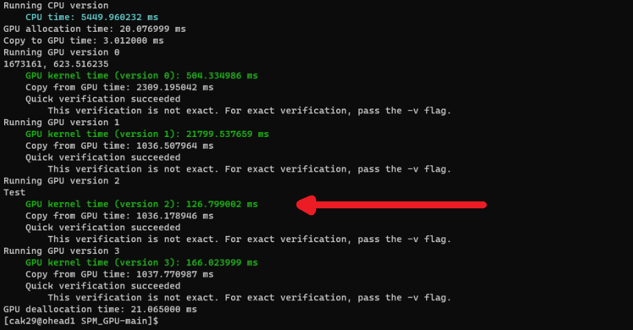

# SPM_GPU
Project for Programming Massively Parallel Processors

 
Include the following modules before compiling on octopus: 
module load cuda 
module load gcc/10.1.0 
 
Progress: 
GPU0: Done 
GPU1: Done (not Efficient) 
GPU2: DONE -- Optimized <<=== most efficient 
GPU3: Done 
GPU4: TODO 
 
 
Our Results for matrix 3  (126 ms) 

